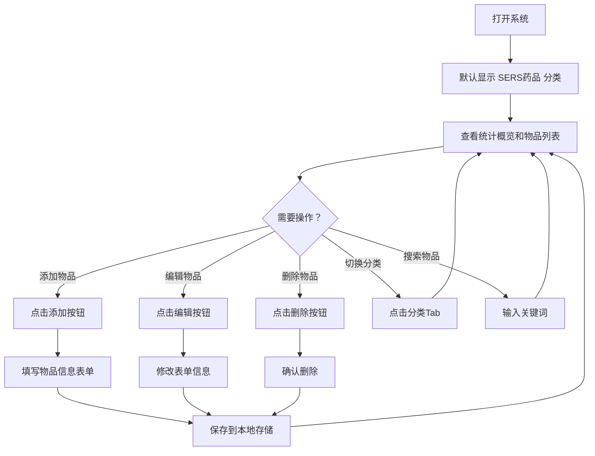

## 1. 产品概述

面向课题组实验室的药品与耗材库存管理系统，帮助科研人员高效管理 SERS 药品、CZTS 药品和实验室耗材的采购、库存与安全信息。

- **目标用户**：课题组科研人员（硕士、博士、博后）
- **核心价值**：统一管理三类物资的采购记录与库存余量，追踪危化品安全信息和保质期，避免重复采购和过期浪费

## 2. 核心功能

### 2.1 用户角色

无需登录，单机本地使用，所有数据存储在浏览器本地。

### 2.2 功能模块

| 功能模块 | 说明 |
|----------|------|
| **分类管理** | 三大分类：SERS药品、CZTS药品、实验室耗材，支持切换查看 |
| **物品录入** | 表单录入药品/耗材信息，包含名称、购买时间、购买公司、危化品标记、保质期、购买量/余量 |
| **物品列表** | 表格展示所有记录，支持按分类筛选、搜索 |
| **编辑删除** | 支持修改已有记录和删除记录 |
| **库存预警** | 余量过低或临近保质期时高亮提醒 |

### 2.3 页面详情

| 页面名称 | 模块名称 | 功能描述 |
|----------|----------|----------|
| 主页面 | 分类Tab切换 | 三个Tab：SERS药品、CZTS药品、实验室耗材，点击切换显示对应分类数据 |
| 主页面 | 搜索栏 | 按药品名称关键词搜索，支持模糊匹配 |
| 主页面 | 添加按钮 | 点击弹出表单，录入：名称、购买时间、购买公司、危化品、保质期、购买量、余量 |
| 主页面 | 数据表格 | 展示当前分类的所有记录，含余量进度条和过期状态标记 |
| 主页面 | 操作列 | 每条记录提供编辑和删除按钮 |
| 主页面 | 统计概览 | 顶部显示当前分类总数、危化品数量、低库存数量、临期数量 |

## 3. 核心流程

## 4. 用户界面设计

### 4.1 设计风格

- **主题**：科技实验室风格，深色背景搭配霓虹色点缀，体现科研氛围
- **主色**：深蓝灰 #0f1923 背景，青色 #00e5ff 强调色
- **辅色**：琥珀色 #ffab00（危化品警告），绿色 #00e676（库存充足），红色 #ff5252（过期/低库存）
- **字体**：标题用 "Orbitron"（科技感），正文用 "Noto Sans SC"（中文阅读舒适）
- **布局**：顶栏统计卡片 + 操作栏 + 下方数据表格，卡片式设计
- **按钮**：圆角矩形，悬停时发光效果

### 4.2 页面设计概览

| 页面名称 | 模块名称 | UI元素 |
|----------|----------|--------|
| 主页面 | 头部标题 | 渐变色标题，实验室图标 |
| 主页面 | 统计卡片 | 4张卡片横向排列：总数、危化品数、低库存数、临期数，图标+数字+标签 |
| 主页面 | 分类Tab | 三个胶囊形Tab，当前选中发光 |
| 主页面 | 操作栏 | 搜索输入框 + 添加按钮，右侧对齐 |
| 主页面 | 数据表格 | 深色表头，斑马纹行，余量进度条，危化品橙色标签，过期行红色背景 |
| 主页面 | 表单弹窗 | 居中模态框，深色背景，表单字段纵向排列，底部提交/取消按钮 |

### 4.3 响应式设计

- 桌面优先，最小适配宽度 1024px
- 表格在小屏幕下可横向滚动
- 统计卡片在移动端变为 2×2 网格

## 5. 数据字段定义

每个物品记录包含以下字段：

| 字段 | 类型 | 说明 |
|------|------|------|
| id | string | 唯一标识符（UUID） |
| category | enum | 分类：sers / czts / consumable |
| name | string | 药品/耗材名称 |
| purchaseDate | string | 购买时间（YYYY-MM-DD） |
| company | string | 购买公司 |
| isHazardous | boolean | 是否为危化品 |
| expiryDate | string | 保质期（YYYY-MM-DD） |
| totalAmount | number | 购买量（数值） |
| unit | string | 单位（g/mL/瓶/个等） |
| remainingAmount | number | 余量（数值） |