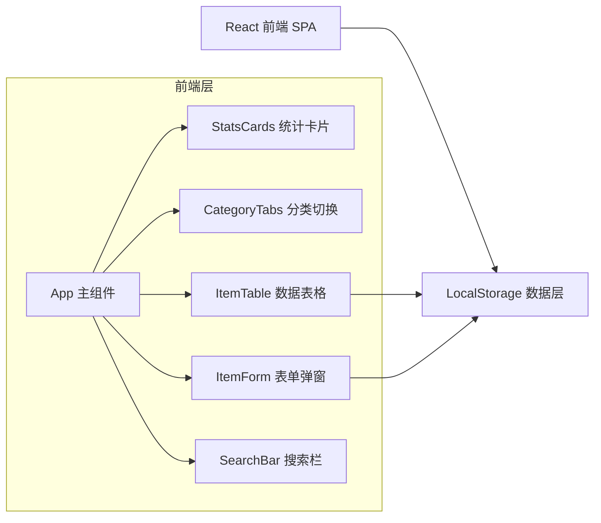
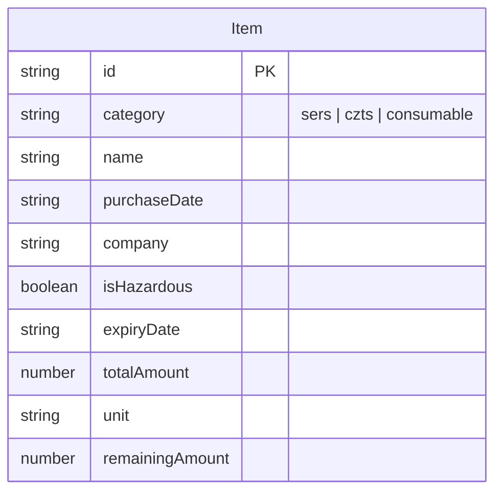

## 1. 架构设计



## 2. 技术说明

- **前端框架**：React 18 + TypeScript
- **构建工具**：Vite 5
- **样式方案**：Tailwind CSS 3 + 自定义 CSS 变量
- **数据存储**：浏览器 LocalStorage（无需后端）
- **字体**：Google Fonts（Orbitron + Noto Sans SC）
- **图标**：Lucide React
- **无额外依赖**：不引入第三方组件库，纯手写组件

## 3. 路由定义

单页应用，无需路由。所有功能在一个页面中完成。

## 4. 数据模型

### 4.1 数据模型定义



### 4.2 TypeScript 类型定义

```typescript
type Category = 'sers' | 'czts' | 'consumable';

interface InventoryItem {
  id: string;
  category: Category;
  name: string;
  purchaseDate: string;       // YYYY-MM-DD
  company: string;
  isHazardous: boolean;
  expiryDate: string;         // YYYY-MM-DD
  totalAmount: number;
  unit: string;               // g, mL, 瓶, 个, etc.
  remainingAmount: number;
}
```

### 4.3 LocalStorage 存储结构

| Key | 类型 | 说明 |
|-----|------|------|
| `lab_inventory_data` | `InventoryItem[]` | 所有物品记录数组 |

## 5. 组件树

```
App
├── Header（标题）
├── StatsCards（统计概览）
│   └── StatCard × 4
├── CategoryTabs（分类切换）
├── ActionBar（操作栏）
│   ├── SearchInput
│   └── AddButton
├── ItemTable（数据表格）
│   └── TableRow × N（含进度条、状态标签、操作按钮）
└── ItemFormModal（表单弹窗）
    └── Form（含所有字段输入）
```

## 6. 文件结构

```
lab-inventory/
├── index.html
├── package.json
├── vite.config.ts
├── tailwind.config.js
├── postcss.config.js
├── tsconfig.json
├── src/
│   ├── main.tsx
│   ├── App.tsx
│   ├── index.css
│   ├── types.ts
│   ├── hooks/
│   │   └── useInventory.ts
│   ├── components/
│   │   ├── Header.tsx
│   │   ├── StatsCards.tsx
│   │   ├── CategoryTabs.tsx
│   │   ├── ActionBar.tsx
│   │   ├── ItemTable.tsx
│   │   └── ItemFormModal.tsx
│   └── utils/
│       └── storage.ts
```